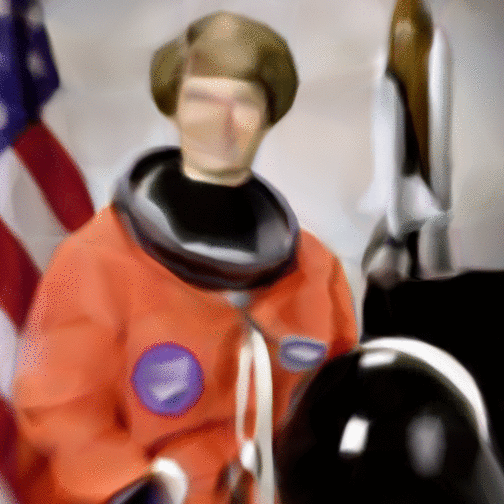

# painting-with-neural-net
Project to train a neural network to paint using TensorFlow.

### Description
In this project I build a multi-layer perceptron fed with pixel position as training data and corresponding RGB colors as labels. I use TensorFlow to build the graph and run training / test processes.

### Result

##### Input image:

##### Progress made through iterations:

### References

- [Kadenze Academy](https://www.kadenze.com/)